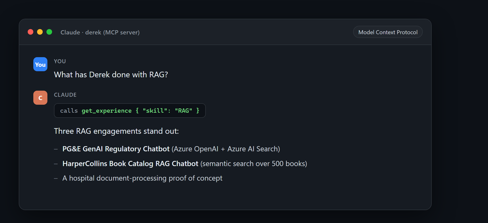
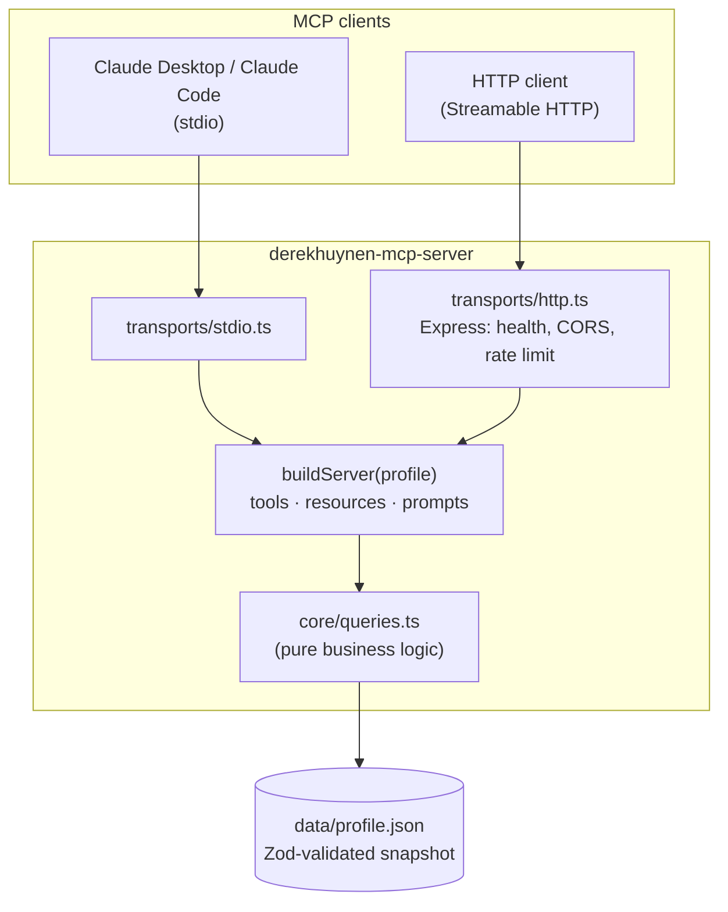

<div align="center">

# derekhuynen-mcp-server

### A production-grade reference MCP server in TypeScript: one core, two transports, strict types, real tests, Docker, and CI

[](https://github.com/derekhuynen/derekhuynen-mcp-server/actions/workflows/ci.yml)
[](./LICENSE)
[](https://nodejs.org)
[](https://www.typescriptlang.org/)
[](https://modelcontextprotocol.io)



</div>

> A production-grade reference implementation of a [Model Context Protocol](https://modelcontextprotocol.io) (MCP) server in TypeScript. One transport-agnostic core, two transports (**stdio** + **Streamable HTTP**), strict types, real tests, Docker, and CI. Clone it, read it, template it.

Most MCP examples are toy, single-file stdio scripts. This is what a **real** MCP server looks like: a clean core that registers tools, resources, and prompts once and serves them over two transports, backed by a validated data layer, a full test suite, a multi-stage Docker build, and CI.

The data it serves happens to be a real professional profile (mine), so the example is end-to-end and honest rather than `foo`/`bar`. But the reason to star it is the **architecture and the patterns**, which transfer to any MCP server you want to build.

## Why you might care

- **The production shape of an MCP server**, not a snippet: clear module boundaries, a `buildServer()` factory, and thin transport entrypoints.
- **Two transports from one core.** Run it locally over stdio (Claude Desktop / Claude Code) or deploy it as a stateless Streamable HTTP service. No logic duplicated between them.
- **Actually tested.** 42 tests, including a real in-memory MCP client driving the server (not mocks).
- **Deploy-ready.** Multi-stage Dockerfile, docker-compose, health check, CORS, rate limiting, graceful shutdown, structured logging, env-based config.
- **Type-safe end to end.** A Zod schema is the single source of truth, with inferred TypeScript types throughout.
- **A pattern worth stealing:** the served content is generated from a single source of truth into a validated, reviewed snapshot, so the public surface never drifts.

## What it exposes

**Tools**

| Tool                | Arguments                            | Description                                |
| ------------------- | ------------------------------------ | ------------------------------------------ |
| `get_profile`       | none                                 | Identity, title, summary, links            |
| `get_contact`       | none                                 | Email and profile links                    |
| `get_skills`        | none                                 | Skills grouped by category                 |
| `get_projects`      | none                                 | Public portfolio projects                  |
| `get_experience`    | `skill?`, `employer?`, `recentOnly?` | Roles and engagements, optionally filtered |
| `search_experience` | `query`                              | Keyword search across roles and projects   |

**Resources:** `profile://summary`, `profile://resume`
**Prompts:** `recruiter_pitch` (arg: `role`)

## See it in action

Once wired into an MCP client like Claude, the model can call the tools to answer questions about the data:

```text
You:    What has Derek done with RAG?
Claude: (calls get_experience { "skill": "RAG" })
        Three RAG engagements stand out:
        - PG&E GenAI Regulatory Chatbot (Azure OpenAI + Azure AI Search)
        - HarperCollins Book Catalog RAG Chatbot (semantic search over 500 books)
        - A hospital document-processing proof of concept
```

The tool call behind that answer returns plain JSON:

```jsonc
// get_experience { "skill": "RAG" }  ->  (one entry shown, trimmed)
[
  {
    "slug": "neudesic-pge-genai-chatbot",
    "project": "GenAI Regulatory Chatbot",
    "title": "AI Developer",
    "employer": "Neudesic (an IBM Company)",
    "client": "PG&E (Pacific Gas & Electric)",
    "start": "2025-01",
    "end": "2025-03",
    "summary": "Core engineer on an enterprise RAG chatbot that let PG&E staff query regulatory, claims, and compliance documents in natural language with real-time, grounded citations.",
    "skills": ["RAG", "Azure OpenAI", "Semantic Kernel", "Azure AI Search"],
    "featured": true,
  },
]
```

## Quick start

```bash
npm install
npm run build
```

### Run over stdio (local MCP clients)

```bash
npm run start:stdio
```

Wire it into **Claude Desktop** (`claude_desktop_config.json`) or **Claude Code**:

```json
{
  "mcpServers": {
    "derek": {
      "command": "node",
      "args": ["/absolute/path/to/derekhuynen-mcp-server/dist/transports/stdio.js"]
    }
  }
}
```

### Run over HTTP

```bash
npm run start:http
# GET  http://localhost:3000/health
# POST http://localhost:3000/mcp   (Streamable HTTP MCP endpoint)
```

Example initialize call:

```bash
curl -X POST http://localhost:3000/mcp \
  -H "Content-Type: application/json" \
  -H "Accept: application/json, text/event-stream" \
  -d '{"jsonrpc":"2.0","id":1,"method":"initialize","params":{"protocolVersion":"2024-11-05","capabilities":{},"clientInfo":{"name":"curl","version":"1.0"}}}'
```

### Run with Docker

```bash
docker compose up --build
curl http://localhost:3000/health
```

## Configuration

| Env var                | Default | Purpose                                          |
| ---------------------- | ------- | ------------------------------------------------ |
| `PORT`                 | `3000`  | HTTP port                                        |
| `LOG_LEVEL`            | `info`  | pino log level                                   |
| `RATE_LIMIT_WINDOW_MS` | `60000` | Rate-limit window in milliseconds                |
| `RATE_LIMIT_MAX`       | `100`   | Max requests per window                          |
| `CORS_ORIGINS`         | `*`     | Comma-separated allowed origins                  |
| `TRUST_PROXY`          | `1`     | Trusted proxy hop count (for correct client IPs) |

## Architecture

A transport-agnostic core (`buildServer(profile)`) registers all tools, resources, and prompts against an in-memory profile loaded and validated from `src/data/profile.json`. Two thin entrypoints connect transports to a freshly built server:



The module layout:

```
src/
  data/
    schema.ts       Zod schema + inferred types (single source of truth)
    loader.ts       parse + validate the snapshot (fail fast)
    profile.json    generated, public-safe data snapshot
  core/
    queries.ts      pure business logic (unit-tested)
    tools.ts        registerTools()      thin adapters over queries
    resources.ts    registerResources()
    prompts.ts      registerPrompts()
    server.ts       buildServer(profile) factory
  transports/
    stdio.ts        stdio entrypoint
    http.ts         Express + Streamable HTTP (health, CORS, rate limit, shutdown)
```

The key property: **one server definition, two entrypoints.** Both transports call the same `buildServer()`, so they can never drift in what they expose.

## Use it as a template

Building your own MCP server? Here is the map:

1. Replace `src/data/` with your own data shape and Zod schema.
2. Rewrite `src/core/queries.ts` with your domain logic (keep it pure; it stays easy to test).
3. Adjust the registrations in `src/core/{tools,resources,prompts}.ts`.
4. Leave `server.ts` and the transports mostly as-is. That plumbing is the reusable part.

## How the data stays honest

`src/data/profile.json` is not hand-written. It is generated from a separate source of truth by `scripts/generate-profile.mjs` (`npm run generate`), which strips anything private and validates the result against the schema before it can ship. This keeps the public surface accurate and is a pattern worth reusing whenever a server exposes curated data.

## Development

```bash
npm run dev:http     # hot TS run of the HTTP server
npm run dev:stdio    # hot TS run of the stdio server
npm test             # vitest
npm run lint
npm run typecheck
```

## Deploy

The repo ships deploy-ready (Dockerfile + compose). The HTTP image is stateless and runs on any container host (Azure Container Apps, Fly.io, Cloud Run, a VPS, and so on). There is no authentication because all data is public by design; the endpoint is protected by Helmet security headers, rate limiting, and CORS. Behind a proxy, set `TRUST_PROXY` so client IPs (and therefore rate limiting) are accurate.

## Tech stack

TypeScript (strict, ESM) - [`@modelcontextprotocol/sdk`](https://github.com/modelcontextprotocol/typescript-sdk) - Zod - Express - pino - Vitest - Docker - GitHub Actions.

## License

MIT (c) Derek Huynen

---

If this helped you understand or build an MCP server, a star is appreciated. It helps other developers find it.
